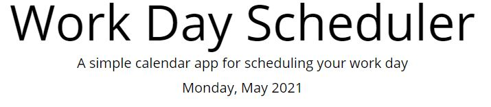
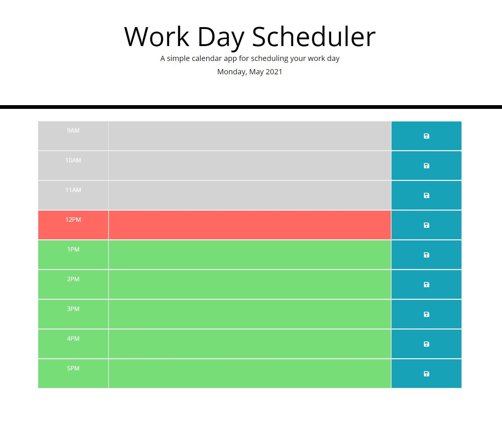
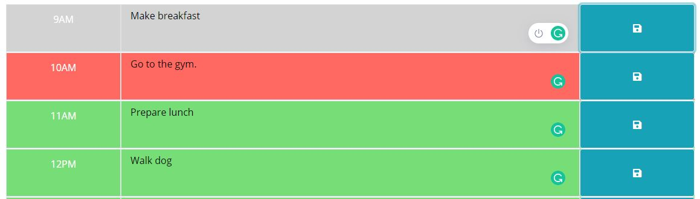

# Work-Day-Scheduler-
## A Work Day Scheduler powered by jQuery
 
https://tmaxey201.github.io/Work-Day-Scheduler-

https://github.com/Tmaxey201/Work-Day-Scheduler-

### The current day is displayed at the top of the calendar when the planner is opened. 

 

  

 

### Timeblocks are presented for standard business hours.  

 

  

 

### Each timeblock is color coded to indicate whether it is in the past, present, or future.  

 

  

 

### Clicking into a timeblock enters an event that is saved to local storage and persists when page is refreshed.  